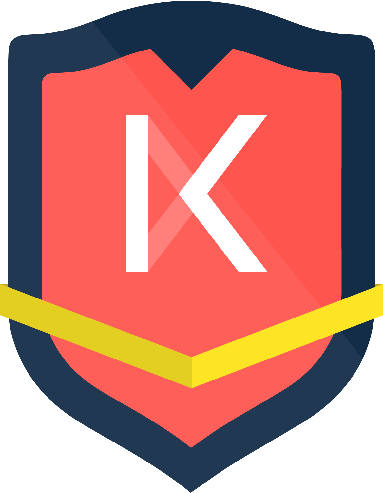
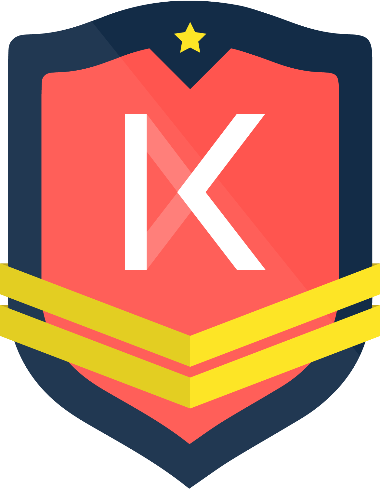

# Become a Founding Member of Kava

> ### Validate & Earn Tokens

Every project begins with those brave few who have vision and grit. Fortune favors the bold, and the Kava community honors validators that participate in testnets and the mainnet launch with a badge commemorating their early validator services and entitling them to Kava tokens.

## Earn Your First Badge!

|                                             |                                                                                                                                                                                                                                                                                                                                                                                                                 |
| ------------------------------------------- | --------------------------------------------------------------------------------------------------------------------------------------------------------------------------------------------------------------------------------------------------------------------------------------------------------------------------------------------------------------------------------------------------------------- |
|  | <h3>The “Founder” Badge</h3>
Kava founders helped secure the network before it was the cool thing to do. Participate in the transition from Testnet #1 to Testnet #2 and stay live through Mainnet launch.
<h4>Reward</h4><ul><li>3,000 KAVA</li></ul><h4>Qualification</h4><ul><li>Validate at least one (1) precommit of Testnet #1</li><li>Validate at least 90% of precommits for Testnet #2</li></ul> |

## Keep Going!

|                                             |                                                                                                                                                                                                                                                                                                                                                                                                                 |
| ------------------------------------------- | --------------------------------------------------------------------------------------------------------------------------------------------------------------------------------------------------------------------------------------------------------------------------------------------------------------------------------------------------------------------------------------------------------------- |
|  | <h3>The “Founder PLUS” Badge</h3>
Success doesn’t follow from time and place alone, it requires persistence. Secure Kava as it goes live to the world and remain highly available as it upgrades in Mainnet environment.
<h4>Reward</h4><ul><li>3,000 KAVA</li></ul><h4>Qualification</h4><ul><li>Validate at least 90% of precommits for the first six (6) consecutive thirty (30) day periods.</li><li>Obtain “Founder” badge</li></ul> |

### General Qualifications

- “Founder” badges restricted to first 100 Kava validators, measured by timestamp of first precommit.
- Only available to residents outside the United States, Canada, China, and OFAC sanctioned countries. Kava badge rewards are not available to entities that participated in the Kava fundraiser.
- Subject to registration and completion of KYC requirements. We will update participants on KYC proceedures at the end of testnet #1.

### Get Started

Follow the documentation [here](https://github.com/Kava-Labs/kava-devnet) to begin validating!

### Join the conversation

Join our community channels on [Riot](https://riot.im/app/#/room/#kava-validators:matrix.org) and [Telegram](https://t.me/kavalabs) to stay up to date and get your questions answered! _And make sure to watch out for future badge announcements!_
