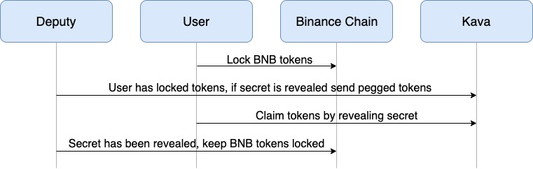
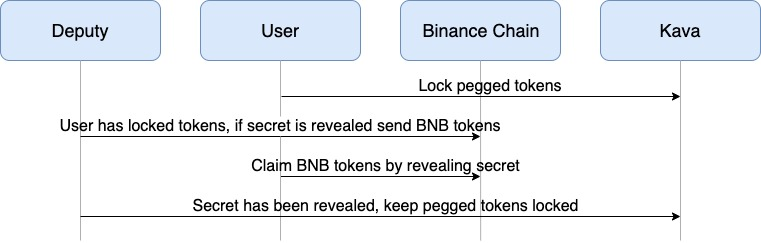

<!--
order: 1
-->

# Concepts

 The BEP3 module implements the [BEP3 protocol](https://github.com/binance-chain/BEPs/blob/master/BEP3.md) for secure cross-chain asset transfers between Kava and other BEP3 compatible chains, such as Binance Chain. Transactions are witnessed and relayed between the two blockchains by Binance's BEP3 deputy process. The deputy maintains an address on both chains and is responsible for delivering tokens upon the successful completion of an Atomic Swap. Learn more about the BEP3 deputy process [here](https://github.com/binance-chain/bep3-deputy).

## Requirements
Kava
- The deputy’s Kava address on mainnet is **kava1r4v2zdhdalfj2ydazallqvrus9fkphmglhn6u6**.
- Kava's official API endpoint is https://kava3.data.kava.io.

Binance Chain
- The deputy’s Binance Chain address on mainnet is **bnb1jh7uv2rm6339yue8k4mj9406k3509kr4wt5nxn**.
- We recommend using https://testnet-dex.binance.org/ as Binance Chain’s API endpoint.

Kava's [JavaScript SDK](https://github.com/Kava-Labs/javascript-sdk) and Binance Chain’s [JavaScript SDK](https://github.com/binance-chain/javascript-sdk) can be used to create, claim, and refund swaps.

## Binance Chain to Kava

When a user wants to transfer tokens from Binance Chain to Kava, the following steps are taken:
1. User’s tokens are locked on Binance Chain along with the hash of a secret only known to the user. If the secret is not revealed before the deadline, the tokens are refundable.
2. The deputy sends a message to Kava saying “a user has locked X tokens, if their secret is revealed before the deadline issue them an equivalent amount of pegged tokens”.
3. The user reveals the secret on Kava and receives the pegged tokens.
4. The deputy relays the secret to Binance Chain and the original tokens are locked permanently.   

## Kava to Binance Chain
1. When a user wants to transfer tokens from Kava to Binance Chain by redeeming pegged tokens, the following steps are taken:
User’s pegged tokens are locked on Kava along with the hash of a secret only known to the user. If the secret is not revealed before the deadline, the tokens are refundable.
2. The deputy sends a message to Binance Chain saying “a user has locked X pegged tokens, if their secret is revealed before the deadline issue them an equivalent amount of tokens”.
3. The user reveals the secret on Binance Chain and receives the tokens.
4. The deputy relays the secret to Kava and the pegged tokens are locked permanently.   

